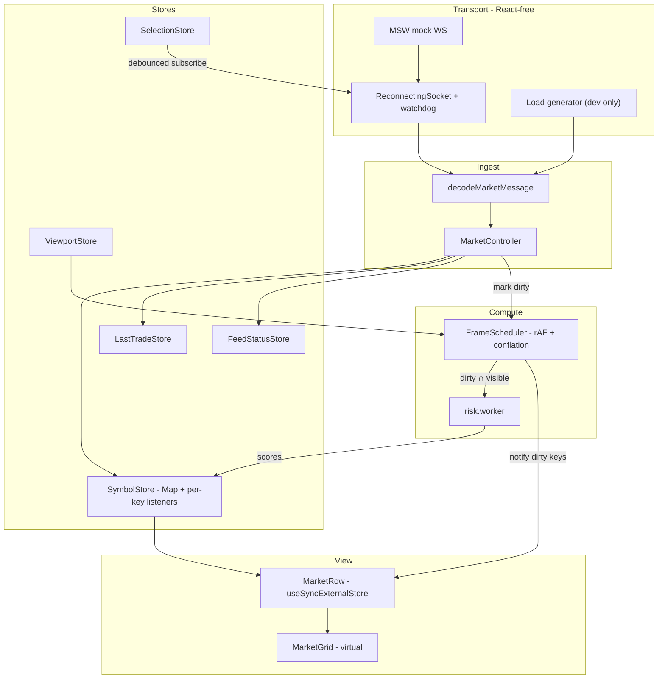

# Architecture — Real-Time Options Terminal

Persian version: [ARCHITECTURE.md](./ARCHITECTURE.md) · Brief: [docs/TASK.md](./docs/TASK.md)

Answers section 5 of the brief: why this stack, 5000 symbols at 5000 messages per
second, and where the bottlenecks are. Numbers are reproducible with
`npm run bench`.

---

## 1. The central idea

**Tick data is never held in React state.**

If rows live in state and each message calls `setState`, cost scales with rows on
screen. At 5000 rows every message reconciles the whole table.

Instead:

1. An incoming message is decoded and written into a `Map`. Nothing renders.
2. Its symbol key is marked dirty.
3. One `requestAnimationFrame` loop notifies only the listeners of dirty keys.
4. Each row subscribes to its own key via `useSyncExternalStore`, so a ticker
   reaches exactly one row.

Cost per message is O(1) in rows.

---

## 2. Decision records

Details in [docs/adr/](./docs/adr/).

| ADR                                                            | Decision                                      | Reason                                                                                            |
| -------------------------------------------------------------- | --------------------------------------------- | ------------------------------------------------------------------------------------------------- |
| [0001](./docs/adr/0001-per-key-store-for-tick-data.md)         | Per-key pub/sub store for ticks               | zustand re-runs every mounted selector on every write                                             |
| [0002](./docs/adr/0002-store-boundary.md)                      | zustand only for low-frequency state          | Filter, status, last trade; the tick path stays bespoke                                           |
| [0003](./docs/adr/0003-viewport-scoped-risk.md)                | Viewport-scoped risk in a Web Worker          | A full-book pass is 40.4 ms and cannot fit a 16.7 ms frame                                        |
| [0004](./docs/adr/0004-liveness-over-connection-state.md)      | Health is data arrival, not `readyState`      | A half-open socket still looks "open"                                                             |
| [0005](./docs/adr/0005-no-table-library.md)                    | Own the column model, keep the virtualizer    | Rows are symbol keys; a row-model table wants the whole book in React state                       |
| [0006](./docs/adr/0006-integration-tests-over-green-checks.md) | Integration tests at the transport boundary   | Typecheck and lint were green while the feed was dead                                             |

### Packages added

The `charisma-task` starter shipped React 19, Vite, TypeScript, ESLint and MSW.
MSW moved to `devDependencies` (mock API and WebSocket). Everything else was added
for a specific clause of the brief.

| Package | Why |
| --- | --- |
| `@tanstack/react-query` | REST snapshot (§1): cache, retry, errors. Live data does not enter Query. |
| `@tanstack/react-query-devtools` | Debug that one query; lazy-loaded. |
| `@tanstack/react-virtual` | Window the grid at 5000 symbols. |
| `zustand` | Low-frequency UI (filter, last trade, status, viewport). Ticks use the per-key store. |
| `@base-ui/react` | Multi-select Combobox and greeks Dialog (§2), RTL. |
| `lucide-react` | Icons. |
| `class-variance-authority`, `clsx`, `tailwind-merge` | Class variants for dark/light theme. |
| `i18next`, `react-i18next` | Persian UI; English is a separate chunk. |
| `tailwindcss`, `@tailwindcss/vite`, `tw-animate-css` | Theme and layout. |
| `@fontsource-variable/vazirmatn` | Persian font. |
| `shadcn` | CLI for Base UI primitives. |
| `vitest`, `jsdom`, `@testing-library/react`, `@testing-library/jest-dom` | Tests (bonus) and `npm run bench`. |
| `prettier`, `prettier-plugin-tailwindcss`, `eslint-plugin-jsx-a11y`, `eslint-plugin-simple-import-sort` | Format, a11y, import order. |
| `react-scan` | `?scan=1` to see extra re-renders. |
| `rollup-plugin-visualizer` | `npm run analyze` for bundle composition. |

The WebSocket client has no extra library: reconnect, `subscribe` and liveness live
in `ReconnectingSocket`.

---

## 3. Designing for 5000 × 5000

`npm run bench` (Apple Silicon, Node 24):

| Workload                                         |     ops/s |  Per pass | Share of a 16.7 ms frame |
| ------------------------------------------------ | --------: | --------: | -----------------------: |
| `calculateRiskScore` — single call               |   168,040 |  0.006 ms |                    0.04% |
| `calculateRiskScore` — 40 symbols (viewport)     |     3,339 |   0.30 ms |                     1.8% |
| `calculateRiskScore` — 5000 symbols (whole book) |      24.7 |  40.43 ms |    242% — **2.4 frames** |
| Decode one ticker                                | 4,034,818 | 0.0002 ms |               negligible |
| Decode 5000 messages (one second at target rate) |     888.6 |   1.13 ms |                     6.8% |

1. **Decoding is not the bottleneck** — a full second of traffic is 1.13 ms.
2. **Whole-book risk does not fit a frame** — 40.43 ms cannot sustain 25 fps even
   with no other work on the thread.

### Challenges

- **Many messages for one symbol in one frame?** Conflation: each flush publishes
  the latest value per dirty key.
- **What can grow without bound?** Nothing. Status and last trade are each one slot.
- **Frame overrun?** The scheduler drops to flushing every second or third frame.
- **Snapshot vs live data?** Each field has a revision; the snapshot fills empty
  fields and never overwrites live values.

---

## 4. Bottlenecks and mitigations

| Bottleneck            | Why                                                     | Mitigation                                                          |
| --------------------- | ------------------------------------------------------- | ------------------------------------------------------------------- |
| `riskCalculator`      | 500-iteration sin/cos loop; 40.43 ms for the whole book | Worker + viewport scope + cache on unchanged inputs                 |
| Successive re-renders | `setState` per message reconciles the whole table       | Per-key subscription + rAF flush + virtualization + `memo` on cells |
| Main-thread decoding  | O(messages)                                             | Hand-written type guards; 1.13 ms per second                        |
| GC pressure           | A new object per tick                                   | Small records; reused `Float64Array` buffer in the worker           |
| DOM size              | 5000 rows = 50,000 cells                                | Virtualization: only the visible window is mounted                  |

---

## 5. Reviewing this quickly

- `npm install && npm run dev` → `http://localhost:5173`
- `npm run verify` — typecheck, lint, format, tests, build, dev tooling excluded
- `npm run bench` — the numbers in section 3
- `?perf=1` — HUD and the 5000-symbol load generator
- `?perf=1&risk=all` — whole-book risk
- `?scan=1` — React Scan; one tick should light one row
- [docs/perf-measurements.md](./docs/perf-measurements.md)
