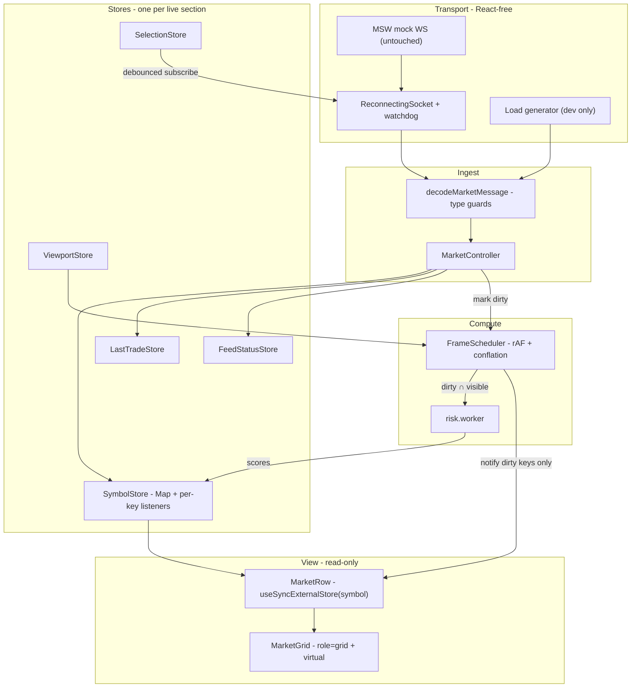

# Architecture — Real-Time Options Terminal

Persian version: [ARCHITECTURE.md](./ARCHITECTURE.md) · Brief: [docs/TASK.md](./docs/TASK.md)

This answers the three questions from section 5 of the brief: why this stack, what
happens at 5000 symbols and 5000 messages per second, and where the bottlenecks
are. Every number quoted here is reproducible with `npm run bench`.

---

## 1. The central idea

**Tick data is never held in React state.**

The conventional shape is to keep rows in state and call `setState` per message.
Cost then scales with _rows on screen_ rather than with symbols that actually
changed, so at 5000 rows every message reconciles the whole table.

Instead:

1. An incoming message is decoded and written into a `Map`. Nothing renders.
2. Its symbol key is marked dirty.
3. One `requestAnimationFrame` loop notifies only the listeners of dirty keys.
4. Each row subscribes to its own key via `useSyncExternalStore`, so a ticker
   reaches exactly one row.

Cost per message is O(1) in rows. Every other decision follows from this one, and
it is what keeps the codebase small.

---

## 2. Decision records

Each decision has its own file in [docs/adr/](./docs/adr/) with context, decision,
consequences and **rejected alternatives**. Summary:

| ADR                                                            | Decision                                      | Short reason                                                                                      |
| -------------------------------------------------------------- | --------------------------------------------- | ------------------------------------------------------------------------------------------------- |
| [0001](./docs/adr/0001-per-key-store-for-tick-data.md)         | Per-key pub/sub store for tick data           | zustand re-runs every mounted selector per write; 5000 rows means 5000 selector calls per message |
| [0002](./docs/adr/0002-store-boundary.md)                      | Where zustand ends and the keyed store begins | zustand is right for low-frequency state; only the tick path stays bespoke                        |
| [0003](./docs/adr/0003-viewport-scoped-risk.md)                | Viewport-scoped risk in a Web Worker          | A full-book pass is 40.4 ms and cannot fit a 16.7 ms frame                                        |
| [0004](./docs/adr/0004-liveness-over-connection-state.md)      | Health is data arrival, not `readyState`      | Half-open sockets, captive portals and wedged servers all look "open"                             |
| [0005](./docs/adr/0005-no-table-library.md)                    | Drop the table library, keep the virtualizer  | 12.9 KiB gzipped against an 8 KiB budget, for column definitions alone                            |
| [0006](./docs/adr/0006-integration-tests-over-green-checks.md) | Integration tests at the transport boundary   | Every check was green while the feed was completely dead                                          |

### Stack choices

- **React 19 + Vite** — the project's existing base. Vite gives workers (`?worker`),
  code splitting and env handling without anything hand-rolled.
- **TanStack Query** for the REST snapshot only: one cached request with retry and
  error states. Deliberately, no live data passes through the Query cache.
- **TanStack Virtual** for windowing. Does one job well, no conflict with the
  architecture.
- **zustand** for low-frequency state (ADR 0002). ~1.2 KiB gzipped and familiar to
  any React developer.
- **Base UI + Tailwind v4** — existing base; accessible Dialog, Tooltip and Combobox.
- **i18next** for fa/en, without the detector and backend plugins. Persian ships in
  the bundle, English is a lazy chunk.
- **No Zod on the message path.** Decoders are hand-written type guards: decoding a
  full second of traffic at the target rate costs 1.13 ms. Strict validation sits
  behind `import.meta.env.DEV`, so development keeps schema safety and production
  keeps the bytes.

### Deliberately not built

No DI container, no general event bus, no plugin system, no abstraction over React
Query, no worker pool, no Storybook for a single-screen app, no state-machine
library for a four-state socket, and no generic `<DataTable>` — this app has one
grid, so it gets one grid.

---

## 3. Designing for 5000 × 5000

### Measured numbers

`npm run bench` (Apple Silicon, Node 24, single-threaded, no browser):

| Workload                                         |     ops/s |  Per pass | Share of a 16.7 ms frame |
| ------------------------------------------------ | --------: | --------: | -----------------------: |
| `calculateRiskScore` — single call               |   168,040 |  0.006 ms |                    0.04% |
| `calculateRiskScore` — 40 symbols (one viewport) |     3,339 |   0.30 ms |                     1.8% |
| `calculateRiskScore` — 5000 symbols (whole book) |      24.7 |  40.43 ms |    242% — **2.4 frames** |
| Decode one valid ticker                          | 4,034,818 | 0.0002 ms |               negligible |
| Decode 5000 messages (one second at target rate) |     888.6 |   1.13 ms |                     6.8% |

Two direct conclusions:

1. **Decoding is not the bottleneck.** A full second of traffic costs 1.13 ms,
   about 0.1% of one second of CPU.
2. **Whole-book risk computation is impossible.** 40.43 ms means even with zero
   other work on the thread, 25 fps is out of reach.

### Questions and challenges this scale raises

This is the most honest section of the document: some of these are implemented,
some are open questions.

**Implemented:**

- **What about many messages for one symbol in a single frame?** Conflation. Each
  flush publishes the latest value per dirty key and drops the rest. If a symbol
  ticked forty times in 16 ms, thirty-nine of those values were never observable —
  dropping them is correct behaviour, not a compromise. The HUD reports the
  conflation ratio so the claim is visible.
- **What can grow without bound?** Nothing. Status is a single slot;
  the last-trade banner is a single slot on a readability throttle. A tab left open
  overnight does not accumulate memory.
- **What if a frame overruns?** The scheduler drops to flushing every second or
  third frame instead of falling progressively behind.
- **Sorting a live column?** At 5000 rows sorted by risk score, rows leapfrog
  continuously and the grid becomes unusable; the fix is not faster sorting. Order
  is recomputed on a throttle and held stable while the pointer is over the grid or
  a scroll is in flight.
- **Snapshot racing live data?** The socket connects immediately and the mock sends
  a burst on connect, so live values routinely arrive _before_ the REST response.
  Applying the snapshot naively overwrites fresh prices with stale ones. Each field
  carries a revision and the snapshot is applied as a _fill_, never a _clobber_.

**Open questions I would take to the server and product teams:**

- **Can the server conflate instead of us?** The cheapest optimisation is a message
  never sent. A professional feed usually offers server-side throttling and
  delta-only updates.
- **Can subscriptions follow the viewport?** Today `subscribe` carries the user's
  selection. At real scale it should be scoped to the visible window plus a margin,
  so bandwidth scales with rows _seen_ rather than with the whole book.
- **Is JSON the right wire format?** At 5000 msg/s, `JSON.parse` is measurable
  (1.13 ms/s). A binary format over `ArrayBuffer` would nearly eliminate it and cut
  GC pressure.
- **What is the freshness budget per column?** Does the risk score need to update 60
  times a second, or would 4 do? If the latter, the problem gets much easier. That
  is a product question, not a technical one.
- **How many concurrent tabs?** Five tabs means five sockets and five times the CPU.
  A `SharedWorker` could share one connection and one risk engine across them.
- **What is correct behaviour during an outage?** Today prices hold their last value
  and are marked stale. In real trading, showing a stale price without a clear
  signal is dangerous; the right behaviour is a business decision.

---

## 4. Bottlenecks and mitigations

| Bottleneck            | Why                                                          | Current mitigation                                                            | If that stops being enough                                            |
| --------------------- | ------------------------------------------------------------ | ----------------------------------------------------------------------------- | --------------------------------------------------------------------- |
| `riskCalculator`      | 500-iteration sin/cos loop; 40.43 ms for the whole book      | One worker + viewport scope + memo cache on unchanged inputs                  | Worker pool (a ten-line change); the numbers say it is not needed yet |
| Successive re-renders | The naive React shape reconciles the whole table per message | Per-key subscription + rAF flush + virtualization + `memo` on cells           | Split the hottest cells out to field-level subscriptions              |
| Main-thread decoding  | O(messages) and unavoidable                                  | Hand-written type guards; measured at 1.13 ms per second                      | Move socket + decoder into a worker and post conflated batches        |
| Order recomputation   | Sorting 5000 entries every frame is expensive                | Throttle + order lock during hover/scroll + array comparison before notifying | Incremental ordered structure (heap) instead of a full sort           |
| GC pressure           | A new record object per tick                                 | Small immutable records; reused `Float64Array` buffer in the worker           | Columnar TypedArray storage instead of an object per symbol           |
| DOM size              | 5000 rows = 50,000 cells                                     | Virtualization: only the visible window is mounted                            | —                                                                     |

### Known limitations and next steps

Honestly, what is unfinished or was not possible in this environment:

- **No heartbeat.** The mock ignores unknown message types, so `ping`/`pong` and RTT
  measurement are impossible and staleness is the only liveness signal. The seam for
  it is `touchWatchdog()` in `socket-client.ts`.
- **The in-browser HUD table is empty.** Left blank rather than filled with invented
  figures; the load-bearing claims sit in the bench table, which anyone can
  reproduce with `npm run bench`.
- **No E2E suite.** Integration tests sit at the transport boundary (ADR 0006).
  Playwright would cover more but is a second toolchain.
- **Decoding is still on the main thread.** Measurement says it does not need to
  move; the path is documented.
- **Subscriptions are not viewport-scoped**, only user-scoped.

### The lesson worth writing down

At one point in this project, `typecheck`, `lint`, `format` and 32 tests were all
green while the application's core feature was completely dead. The client built
its socket address from `window.location`, producing `ws://localhost:5173/ws/options`;
MSW matches the whole URL and the mock registers `ws://localhost/ws/options` with no
port, so no handler ever matched. The browser opened a real socket against the Vite
port, it failed, and the client ran out its backoff. The grid rendered the REST
snapshot once and then nothing.

None of those checks could have caught it: the bug lived in a string that no test
asserted and no type could constrain. That is precisely the argument for the
[contract test](./src/test/mock-feed-contract.test.ts), which checks the resolved
address against the handler's own `test()` method, and for the integration test that
drives a real message end to end.

---

## 5. Reviewing this quickly

- `npm install && npm run dev` → `http://localhost:5173`
- `npm run verify` — typecheck, lint, format, knip, tests, build, and the check that
  dev tooling is absent from the production bundle
- `npm run bench` — the numbers in section 3
- `?perf=1` — performance HUD and the 5000-symbol load generator
- `?perf=1&risk=all` — switch to whole-book risk computation and watch it degrade
- `?scan=1` — React Scan; one tick should light up exactly one row
- Details: [docs/perf-measurements.md](./docs/perf-measurements.md) · Contributing:
  [CONTRIBUTING.md](./CONTRIBUTING.md)
