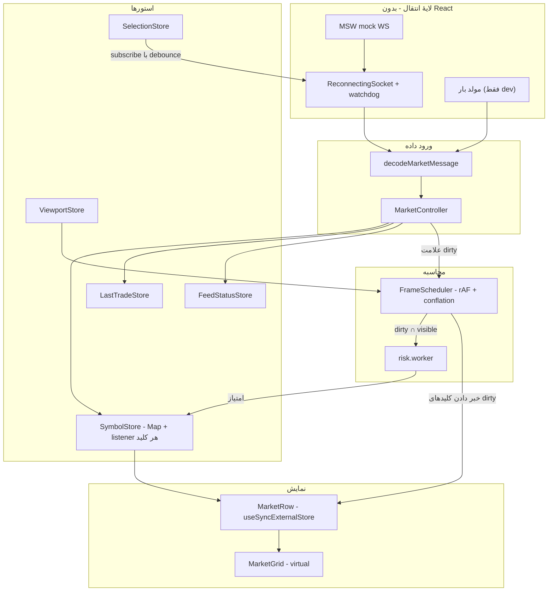

# معماری — ترمینال آپشن (Real-Time)

نسخهٔ انگلیسی: [ARCHITECTURE.en.md](./ARCHITECTURE.en.md) · صورت مسئله: [docs/TASK.md](./docs/TASK.md)

پاسخ بخش ۵ تسک: چرا این استک، مقیاس ۵۰۰۰ نماد و ۵۰۰۰ پیام در ثانیه، و گلوگاه‌ها. اعداد با `npm run bench` قابل بازتولیدند.

---

## ۱. ایدهٔ مرکزی

**دادهٔ لحظه‌ای هرگز در استیت React نگه داشته نمی‌شود.**

اگر ردیف‌ها در state باشند و روی هر پیام `setState` صدا شود، هزینه با تعداد ردیف‌های روی صفحه رشد می‌کند. با ۵۰۰۰ ردیف هر پیام کل جدول را reconcile می‌کند.

به جای آن:

1. پیام decode می‌شود و در یک `Map` نوشته می‌شود. رندری رخ نمی‌دهد.
2. کلید آن نماد dirty علامت می‌خورد.
3. یک حلقهٔ `requestAnimationFrame` فقط listenerهای کلیدهای dirty را خبر می‌کند.
4. هر ردیف با `useSyncExternalStore` مشترک کلید خودش است؛ یک ticker دقیقاً به یک ردیف می‌رسد.

هزینهٔ هر پیام نسبت به تعداد ردیف‌ها O(1) است.

---

## ۲. مستندات تصمیم‌گیری (ADR)

جزئیات در [docs/adr/](./docs/adr/).

| ADR                                                            | تصمیم                                         | دلیل                                                                                               |
| -------------------------------------------------------------- | --------------------------------------------- | -------------------------------------------------------------------------------------------------- |
| [0001](./docs/adr/0001-per-key-store-for-tick-data.md)         | استور pub/sub کلید‌محور برای tick             | zustand روی هر نوشتن همهٔ selectorهای mount‌شده را اجرا می‌کند                                     |
| [0002](./docs/adr/0002-store-boundary.md)                      | zustand فقط برای استیت کم‌تکرار               | فیلتر، وضعیت، آخرین معامله؛ مسیر tick بومی می‌ماند                                                 |
| [0003](./docs/adr/0003-viewport-scoped-risk.md)                | ریسک در Worker، محدود به viewport             | یک pass روی ۵۰۰۰ نماد ۴۰٫۴ms است؛ در فریم ۱۶٫۷ms جا نمی‌شود                                        |
| [0004](./docs/adr/0004-liveness-over-connection-state.md)      | سلامت اتصال = رسیدن داده، نه `readyState`     | سوکت نیمه‌باز هم «open» به نظر می‌رسد                                                              |
| [0005](./docs/adr/0005-no-table-library.md)                    | مدل ستون مال خودمان + virtualizer             | ردیف‌ها کلید نمادند؛ مدل ردیف آماده کل تابلو را در استیت React می‌خواهد                            |
| [0006](./docs/adr/0006-integration-tests-over-green-checks.md) | تست یکپارچه روی مرز transport                 | typecheck و lint سبز بودند در حالی که فید مرده بود                                                 |

### بسته‌های اضافه‌شده

استارتر `charisma-task` این‌ها را داشت: React 19، Vite، TypeScript، ESLint، MSW. MSW به `devDependencies` منتقل شد (mock API و WebSocket). بقیه برای بند مشخصی از تسک اضافه شده‌اند.

| بسته | چرا |
| --- | --- |
| `@tanstack/react-query` | اسنپ‌شات REST (§۱): کش، retry، خطا. دادهٔ زنده وارد Query نمی‌شود. |
| `@tanstack/react-query-devtools` | دیباگ همان یک query؛ lazy-load. |
| `@tanstack/react-virtual` | windowing جدول در مقیاس ۵۰۰۰ نماد. |
| `zustand` | استیت کم‌تکرار (فیلتر، آخرین معامله، وضعیت، viewport). tick در استور کلید‌محور است. |
| `@base-ui/react` | Combobox چندانتخابی و Dialog یونانی‌ها (§۲)، RTL. |
| `lucide-react` | آیکون. |
| `class-variance-authority`, `clsx`, `tailwind-merge` | variant کلاس‌ها برای تم دارک/لایت. |
| `i18next`, `react-i18next` | UI فارسی؛ انگلیسی chunk جدا. |
| `tailwindcss`, `@tailwindcss/vite`, `tw-animate-css` | تم و استایل. |
| `@fontsource-variable/vazirmatn` | فونت فارسی. |
| `shadcn` | CLI برای primitiveهای Base UI. |
| `vitest`, `jsdom`, `@testing-library/react`, `@testing-library/jest-dom` | تست (امتیاز مثبت) و `npm run bench`. |
| `prettier`, `prettier-plugin-tailwindcss`, `eslint-plugin-jsx-a11y`, `eslint-plugin-simple-import-sort` | فرمت، a11y، ترتیب import. |
| `react-scan` | `?scan=1` برای دیدن رندر اضافه. |
| `rollup-plugin-visualizer` | `npm run analyze` برای ترکیب باندل. |

اتصال WebSocket بدون کتابخانه است: reconnect، `subscribe` و زنده‌بودن در `ReconnectingSocket` است.

---

## ۳. طراحی برای مقیاس ۵۰۰۰ × ۵۰۰۰

`npm run bench` (Apple Silicon، Node 24):

| بار کاری                                     |     ops/s | زمان هر pass |  سهم از فریم ۱۶٫۷ms |
| -------------------------------------------- | --------: | -----------: | ------------------: |
| `calculateRiskScore` — یک فراخوانی           |   ۱۶۸٬۰۴۰ |      ۰٫۰۰۶ms |               ۰٫۰۴٪ |
| `calculateRiskScore` — ۴۰ نماد (viewport)    |     ۳٬۳۳۹ |       ۰٫۳۰ms |                ۱٫۸٪ |
| `calculateRiskScore` — ۵۰۰۰ نماد (کل تابلو)  |      ۲۴٫۷ |      ۴۰٫۴۳ms | ۲۴۲٪ — **۲٫۴ فریم** |
| decode یک ticker                             | ۴٬۰۳۴٬۸۱۸ |     ۰٫۰۰۰۲ms |               ناچیز |
| decode ۵۰۰۰ پیام (یک ثانیه در نرخ هدف)       |     ۸۸۸٫۶ |       ۱٫۱۳ms |                ۶٫۸٪ |

1. **decode گلوگاه نیست** — یک ثانیه ترافیک ۱٫۱۳ms است.
2. **ریسک روی کل تابلو در یک فریم جا نمی‌شود** — ۴۰٫۴۳ms حتی با صفر کار دیگر ۲۵fps نمی‌دهد.

### چالش‌ها

- **چند پیام در یک فریم برای یک نماد؟** conflation: هر flush آخرین مقدار هر کلید dirty را می‌فرستد.
- **چه چیزی بی‌مرز رشد می‌کند؟** هیچ‌چیز. وضعیت و آخرین معامله هر کدام یک خانه است.
- **اگر فریم از بودجه رد شد؟** scheduler به flush یک‌درمیان یا یکی‌از‌سه می‌افتد.
- **اسنپ‌شات در برابر دادهٔ زنده؟** هر فیلد revision دارد؛ اسنپ‌شات خانه‌های خالی را پر می‌کند، بازنویسی نمی‌کند.

---

## ۴. گلوگاه‌ها و راهکارها

| گلوگاه                 | چرا                                          | راهکار                                                                |
| ---------------------- | -------------------------------------------- | --------------------------------------------------------------------- |
| فرمول `riskCalculator` | حلقهٔ ۵۰۰تایی sin/cos؛ ۴۰٫۴۳ms برای کل تابلو | Worker + محدود به viewport + کش روی ورودی بدون تغییر                  |
| رندرهای پیاپی          | `setState` روی هر پیام کل جدول را reconcile می‌کند | اشتراک کلید‌محور + flush در rAF + virtualization + `memo` روی سلول‌ها |
| decode روی رشتهٔ اصلی  | O(تعداد پیام)                                | type guard دستی؛ ۱٫۱۳ms در ثانیه                                      |
| فشار GC                | آبجکت جدید به ازای هر tick                   | رکوردهای کوچک؛ بافر `Float64Array` بازاستفاده‌شده در worker           |
| ارتفاع DOM             | ۵۰۰۰ ردیف = ۵۰٬۰۰۰ سلول                      | virtualization: فقط پنجرهٔ دیده‌شده mount می‌شود                      |

---

## ۵. بررسی سریع

- `npm install && npm run dev` → `http://localhost:5173`
- `npm run verify` — typecheck، lint، format، تست، build، حذف ابزار dev از باندل
- `npm run bench` — اعداد بخش ۳
- `?perf=1` — HUD و مولد بار ۵۰۰۰ نماد
- `?perf=1&risk=all` — ریسک روی کل تابلو
- `?scan=1` — React Scan؛ یک tick باید یک ردیف را روشن کند
- [docs/perf-measurements.md](./docs/perf-measurements.md)
