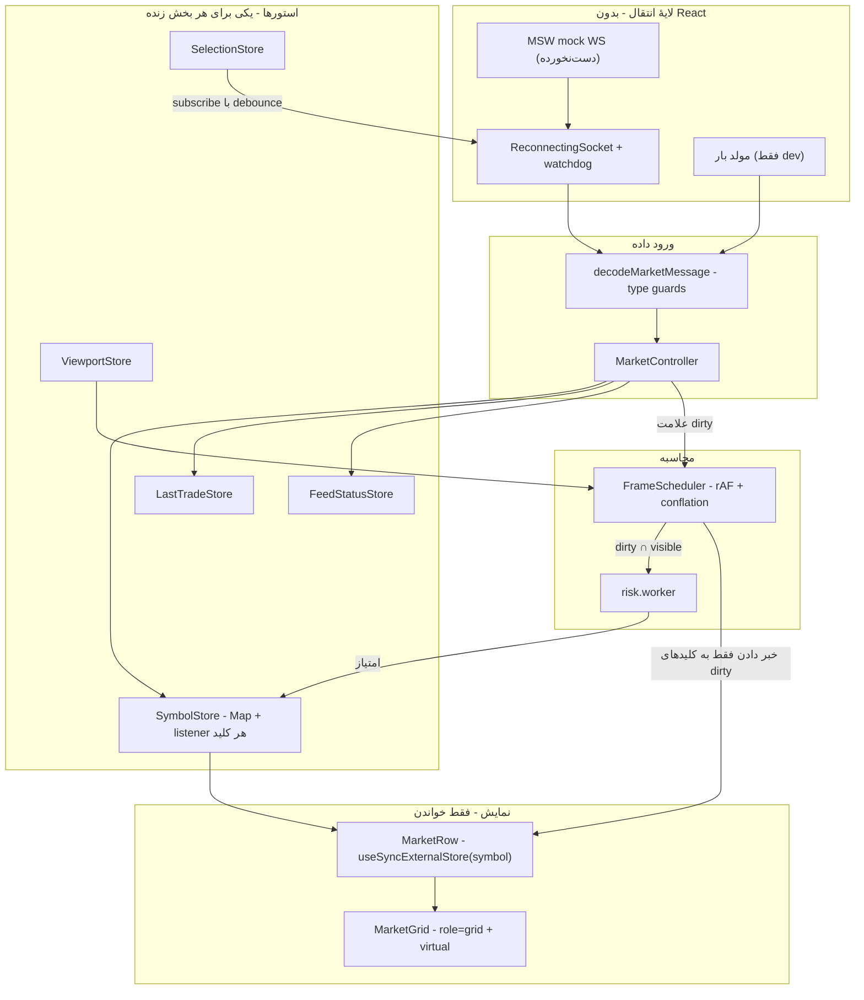

# معماری — ترمینال آپشن (Real-Time)

نسخهٔ انگلیسی: [ARCHITECTURE.en.md](./ARCHITECTURE.en.md) · صورت مسئله: [docs/TASK.md](./docs/TASK.md)

این سند به سه پرسش بخش ۵ تسک پاسخ می‌دهد: چرا این استک انتخاب شد، اگر مقیاس به ۵۰۰۰ نماد و ۵۰۰۰ پیام در ثانیه برسد چه می‌شود، و گلوگاه‌های معماری فعلی کجاست. هرجا عددی گفته شده، با `npm run bench` قابل بازتولید است.

---

## ۱. ایدهٔ مرکزی

**دادهٔ لحظه‌ای هرگز در استیت React نگه داشته نمی‌شود.**

شکل ساده و متعارف این است که ردیف‌ها در state باشند و روی هر پیام `setState` صدا زده شود. در آن حالت هزینهٔ هر پیام با _تعداد ردیف‌های روی صفحه_ رشد می‌کند، نه با تعداد نمادهایی که واقعاً تغییر کرده‌اند. با ۵۰۰۰ ردیف، این یعنی هر پیام کل جدول را reconcile می‌کند.

به جای آن:

1. پیام رسیده decode می‌شود و مقدارش در یک `Map` نوشته می‌شود. هیچ رندری اتفاق نمی‌افتد.
2. کلید آن نماد «dirty» علامت می‌خورد.
3. یک حلقهٔ `requestAnimationFrame` در هر فریم فقط listener‌های کلیدهای dirty را خبر می‌کند.
4. هر ردیف با `useSyncExternalStore` مشترک کلید خودش است، پس یک ticker دقیقاً به یک ردیف می‌رسد.

هزینهٔ هر پیام نسبت به تعداد ردیف‌ها O(1) است. تمام تصمیم‌های بعدی نتیجهٔ همین یک انتخاب‌اند و همین است که کد را کوچک نگه می‌دارد.

---

## ۲. مستندات تصمیم‌گیری (ADR)

هر تصمیم یک فایل جداگانه در [docs/adr/](./docs/adr/) دارد که شامل زمینه، تصمیم، پیامدها و **گزینه‌های رد شده** است. خلاصه:

| ADR                                                            | تصمیم                                         | دلیل کوتاه                                                                                                  |
| -------------------------------------------------------------- | --------------------------------------------- | ----------------------------------------------------------------------------------------------------------- |
| [0001](./docs/adr/0001-per-key-store-for-tick-data.md)         | استور pub/sub کلید‌محور برای دادهٔ tick       | زوستند روی هر نوشتن همهٔ selector‌های mount‌شده را اجرا می‌کند؛ با ۵۰۰۰ ردیف یعنی ۵۰۰۰ اجرا به ازای هر پیام |
| [0002](./docs/adr/0002-store-boundary.md)                      | مرز zustand و استور کلید‌محور                 | zustand برای استیت کم‌تکرار (فیلتر، وضعیت، آخرین معامله…) درست است؛ فقط مسیر tick بومی می‌ماند              |
| [0003](./docs/adr/0003-viewport-scoped-risk.md)                | محاسبهٔ ریسک محدود به viewport، در Web Worker | یک pass روی ۵۰۰۰ نماد ۴۰٫۴ms است؛ در بودجهٔ ۱۶٫۷ms فریم جا نمی‌شود                                          |
| [0004](./docs/adr/0004-liveness-over-connection-state.md)      | سلامت اتصال = رسیدن داده، نه `readyState`     | سوکت نیمه‌باز، captive portal و سرور قفل‌شده همه «open» به نظر می‌رسند                                      |
| [0005](./docs/adr/0005-no-table-library.md)                    | حذف کتابخانهٔ جدول، نگه‌داشتن virtualizer     | ۱۲٫۹ KiB gzip در مقابل بودجهٔ ۸ KiB، برای فقط تعریف ستون                                                    |
| [0006](./docs/adr/0006-integration-tests-over-green-checks.md) | تست یکپارچه روی مرز transport                 | همهٔ چک‌ها سبز بودند در حالی که فید کاملاً مرده بود                                                         |

### انتخاب استک

- **React 19 + Vite** — پایهٔ موجود پروژه. Vite برای worker (`?worker`)، code splitting و متغیرهای محیطی چیزی نمی‌خواهد که دستی ساخته شود.
- **TanStack Query** فقط برای اسنپ‌شات REST. یک درخواست با کش، retry و حالت خطا؛ نوشتن دستی‌اش بی‌دلیل است. عمداً هیچ دادهٔ زنده‌ای از کش Query عبور نمی‌کند.
- **TanStack Virtual** برای windowing. یک کار را خوب انجام می‌دهد و با معماری ما تضادی ندارد.
- **zustand** برای استیت کم‌تکرار (ADR 0002). حدود ۱٫۲ KiB gzip، و برای هر توسعه‌دهندهٔ React آشناست.
- **Base UI + Tailwind v4** — پایهٔ موجود؛ Dialog، Tooltip و Combobox قابل دسترس با a11y درست.
- **i18next** برای دو‌زبانه بودن، بدون پلاگین detector و backend. فارسی همراه باندل و انگلیسی به‌صورت chunk جدا.
- **بدون Zod روی مسیر پیام.** decoder‌ها type guard دستی‌اند: decode یک ثانیه ترافیک در نرخ هدف ۱٫۱۳ms است. اعتبارسنجی سخت‌گیرانه پشت `import.meta.env.DEV` است، پس در dev ایمنی و در production بایت کمتر داریم.

### چیزهایی که عمداً ساخته نشد

بدون DI container، بدون event bus عمومی، بدون plugin system، بدون لایهٔ انتزاعی روی React Query، بدون worker pool، بدون Storybook برای اپلیکیشنی با یک صفحه، بدون کتابخانهٔ state machine برای سوکتی با چهار حالت، و بدون `<DataTable>` جنریک — این پروژه یک جدول دارد، پس یک جدول می‌گیرد.

---

## ۳. طراحی برای مقیاس ۵۰۰۰ × ۵۰۰۰

### اعداد اندازه‌گیری‌شده

`npm run bench` (Apple Silicon، Node 24، تک‌رشته‌ای، بدون مرورگر):

| بار کاری                                     |     ops/s | زمان هر pass |  سهم از فریم ۱۶٫۷ms |
| -------------------------------------------- | --------: | -----------: | ------------------: |
| `calculateRiskScore` — یک فراخوانی           |   ۱۶۸٬۰۴۰ |      ۰٫۰۰۶ms |               ۰٫۰۴٪ |
| `calculateRiskScore` — ۴۰ نماد (یک viewport) |     ۳٬۳۳۹ |       ۰٫۳۰ms |                ۱٫۸٪ |
| `calculateRiskScore` — ۵۰۰۰ نماد (کل تابلو)  |      ۲۴٫۷ |      ۴۰٫۴۳ms | ۲۴۲٪ — **۲٫۴ فریم** |
| decode یک ticker معتبر                       | ۴٬۰۳۴٬۸۱۸ |     ۰٫۰۰۰۲ms |               ناچیز |
| decode ۵۰۰۰ پیام (یک ثانیه در نرخ هدف)       |     ۸۸۸٫۶ |       ۱٫۱۳ms |                ۶٫۸٪ |

دو نتیجهٔ مستقیم:

1. **decode گلوگاه نیست.** یک ثانیه ترافیک کامل ۱٫۱۳ms است، حدود ۰٫۱٪ از یک ثانیه CPU.
2. **محاسبهٔ ریسک روی کل تابلو غیرممکن است.** ۴۰٫۴۳ms یعنی حتی با صفر کار دیگر روی رشته، ۲۵fps هم به دست نمی‌آید.

### سوال‌ها و چالش‌هایی که این مقیاس ایجاد می‌کند

این بخش صادقانه‌ترین قسمت سند است: بعضی از این‌ها پیاده شده و بعضی سوال باز است.

**پیاده‌شده:**

- **چند پیام در یک فریم برای یک نماد چه می‌شود؟** conflation. هر flush آخرین مقدار هر کلید dirty را منتشر می‌کند و بقیه را می‌اندازد. اگر نمادی در ۱۶ms چهل بار tick بزند، سی‌ونه مقدار هرگز قابل مشاهده نبودند؛ انداختنشان رفتار درست است، نه سازش. HUD نسبت conflation را نشان می‌دهد تا این ادعا دیده شود.
- **چه چیزی می‌تواند بی‌مرز رشد کند؟** هیچ‌چیز. وضعیت یک خانه است؛ بنر آخرین معامله یک خانه با throttle خوانایی است. یک تب که تمام شب باز بماند حافظه نمی‌خورد.
- **اگر فریم از بودجه رد شد؟** scheduler به flush یک فریم در میان یا یکی از هر سه می‌افتد، به جای اینکه پیوسته عقب بیفتد.
- **رقابت اسنپ‌شات با دادهٔ زنده؟** سوکت فوراً وصل می‌شود و mock روی connect یک burst می‌فرستد، پس مقادیر زنده معمولاً _قبل_ از پاسخ REST می‌رسند. اعمال ساده‌لوحانهٔ اسنپ‌شات قیمت‌های تازه را با قیمت کهنه بازنویسی می‌کند. هر فیلد یک revision دارد و اسنپ‌شات به‌صورت _پر کردن_ اعمال می‌شود، نه _بازنویسی_.

**سوال‌های باز که برای مقیاس واقعی باید از سرور/محصول پرسید:**

- **آیا سرور می‌تواند به‌جای ما conflate کند؟** ارزان‌ترین بهینه‌سازی، پیامی است که هرگز فرستاده نشود. یک فید حرفه‌ای معمولاً throttle سمت سرور و «فقط دلتا» دارد.
- **آیا اشتراک می‌تواند به viewport محدود شود؟** الان `subscribe` را با انتخاب کاربر می‌فرستیم. در مقیاس واقعی باید محدود به پنجرهٔ دیده‌شده (به‌علاوهٔ حاشیه) شود تا پهنای باند با تعداد ردیف‌های _دیده‌شده_ رشد کند، نه کل تابلو.
- **آیا JSON فرمت درستی است؟** در ۵۰۰۰ پیام در ثانیه، `JSON.parse` قابل اندازه‌گیری است (۱٫۱۳ms/s). یک فرمت باینری (protobuf/flatbuffers) روی `ArrayBuffer` این را تقریباً حذف می‌کند و بار GC را هم کم می‌کند.
- **بودجهٔ تازگی هر ستون چقدر است؟** آیا امتیاز ریسک باید ۶۰ بار در ثانیه به‌روز شود یا ۴ بار در ثانیه کافی است؟ اگر دومی درست باشد، مسئله بسیار ساده‌تر می‌شود. این یک سوال محصولی است، نه فنی.
- **چند تب همزمان؟** پنج تب یعنی پنج سوکت و پنج برابر CPU. یک `SharedWorker` می‌تواند یک اتصال و یک موتور ریسک را بین تب‌ها به اشتراک بگذارد.
- **رفتار درست هنگام قطعی چیست؟** الان قیمت آخرین‌مقدار را نگه می‌داریم و stale علامت می‌زنیم. در معاملات واقعی، نمایش قیمت کهنه بدون نشانهٔ واضح خطرناک است؛ رفتار درست باید با کسب‌وکار تعیین شود.

---

## ۴. گلوگاه‌ها و راهکارها

| گلوگاه                 | چرا                                                         | راهکار فعلی                                                           | اگر کافی نبود                                                       |
| ---------------------- | ----------------------------------------------------------- | --------------------------------------------------------------------- | ------------------------------------------------------------------- |
| فرمول `riskCalculator` | حلقهٔ ۵۰۰تایی sin/cos؛ ۴۰٫۴۳ms برای کل تابلو                | یک Worker + محدود به viewport + کش روی ورودی بدون تغییر               | Worker pool (تغییری ده‌خطی)؛ اعداد نشان می‌دهند فعلاً لازم نیست     |
| رندرهای پیاپی          | ساده‌ترین شکل React روی هر پیام کل جدول را reconcile می‌کند | اشتراک کلید‌محور + flush در rAF + virtualization + `memo` روی سلول‌ها | جداکردن سلول‌های پرتکرار به اشتراک fieldی                           |
| decode روی رشتهٔ اصلی  | O(تعداد پیام) و اجتناب‌ناپذیر                               | type guard دستی؛ اندازه‌گیری‌شده ۱٫۱۳ms در ثانیه                      | انتقال سوکت + decoder به داخل worker و ارسال batch‌های conflate‌شده |
| فشار GC                | آبجکت رکورد جدید به ازای هر tick                            | رکوردهای immutable کوچک؛ بافر `Float64Array` بازاستفاده‌شده در worker | ساختار ستونی روی TypedArray به جای آبجکت به ازای نماد               |
| ارتفاع DOM             | ۵۰۰۰ ردیف = ۵۰٬۰۰۰ سلول                                     | virtualization: فقط پنجرهٔ دیده‌شده mount می‌شود                      | —                                                                   |

### حدود شناخته‌شده و کارهای بعدی

صادقانه، آنچه تمام نشده یا در محیط این تسک ممکن نبود:

- **heartbeat وجود ندارد.** mock پیام‌های ناشناس را نادیده می‌گیرد، پس `ping`/`pong` و اندازه‌گیری RTT ممکن نیست و staleness تنها سیگنال زنده‌بودن است. جای اتصالش `touchWatchdog()` بعد از یک فریم decode‌شده است، نه روی `open`.
- **جدول اعداد HUD در مرورگر خالی است.** به‌جای پر کردن با عدد ساختگی، خالی مانده؛ ادعاهای اصلی روی جدول bench هستند که هر کسی با `npm run bench` بازتولید می‌کند.
- **تست E2E نداریم.** تست‌های یکپارچه روی مرز transport هستند (ADR 0006). Playwright این‌ها را کامل‌تر می‌کرد اما یک زنجیرهٔ ابزار دیگر است.
- **decode هنوز روی رشتهٔ اصلی است.** اندازه‌گیری می‌گوید لازم نیست جابه‌جا شود؛ مسیرش مستند است.
- **اشتراک به viewport محدود نیست**، فقط به انتخاب کاربر.

### درسی که ارزش نوشتن دارد

در مقطعی از این پروژه، `typecheck` و `lint` و `format` و ۳۲ تست، همه سبز بودند، در حالی که اصلی‌ترین قابلیت برنامه کاملاً مرده بود. کلاینت آدرس سوکت را از `window.location` می‌ساخت و `ws://localhost:5173/ws/options` درمی‌آمد؛ MSW کل URL را تطبیق می‌دهد و mock روی `ws://localhost/ws/options` بدون پورت ثبت شده است، پس هیچ handler‌ی تطبیق نمی‌شد. مرورگر یک سوکت واقعی به پورت Vite می‌زد، شکست می‌خورد، و کلاینت تا انتهای backoff می‌رفت. جدول یک بار اسنپ‌شات REST را رندر می‌کرد و بعد هیچ.

هیچ‌کدام از آن چک‌ها نمی‌توانستند این را بگیرند: باگ در یک رشتهٔ متنی بود که هیچ تستی assert نمی‌کرد و هیچ تایپی محدودش نمی‌کرد. این دقیقاً استدلال وجود [تست contract](./src/test/mock-feed-contract.test.ts) است که آدرس resolve‌شده را با `test()` خودِ handler می‌سنجد، و تست یکپارچه‌ای که واقعاً پیام را از سر تا ته عبور می‌دهد.

---

## ۵. راهنمای بررسی سریع

- `npm install && npm run dev` → `http://localhost:5173`
- `npm run verify` — typecheck، lint، format، knip، تست‌ها، build، و بررسی حذف ابزار dev از باندل production
- `npm run bench` — اعداد بخش ۳
- `?perf=1` — HUD کارایی و مولد بار ۵۰۰۰ نماد
- `?perf=1&risk=all` — سوئیچ به محاسبهٔ ریسک روی کل تابلو، برای دیدن افت
- `?scan=1` — React Scan؛ یک tick باید فقط یک ردیف را روشن کند
- جزئیات: [docs/perf-measurements.md](./docs/perf-measurements.md)
