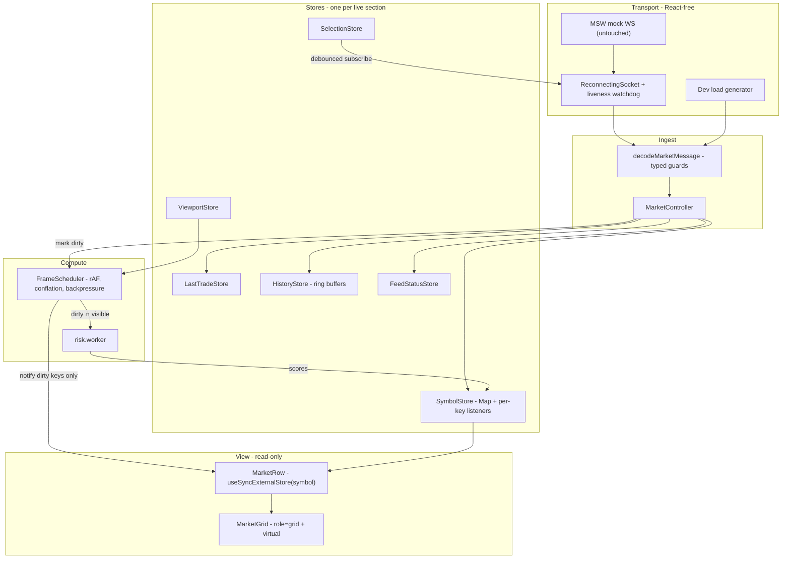

# Implementation Plan — Real-Time Options Terminal

> **Status:** Phase 7 complete; Phase 8+ not started.
> **Purpose:** this is the working engineering plan for the task described in [TASK.md](./TASK.md). It records _what_ will be built, in _what order_, and _why_ each significant decision was taken. It is the source material for `ARCHITECTURE.md` (Persian) and `ARCHITECTURE.en.md`, which are the graded deliverables; the decisions listed here become numbered ADRs under `docs/adr/`.
> **Audience:** the reviewer, and whoever inherits this codebase next.

## Contents

- [Where the code stands](#where-the-code-stands)
- [Hard constraints](#hard-constraints)
- [Target architecture](#target-architecture)
- [Feed resilience](#feed-resilience)
- [Key decisions](#key-decisions)
- [Bundle, splitting, readability](#honouring-bundle-splitting-and-readability)
- [Deliberately not building](#deliberately-not-building)
- [Directory structure](#directory-structure)
- [Wire-protocol realities](#wire-protocol-realities-the-mock-exposes)
- [Correctness details easy to get wrong](#correctness-and-ux-details-that-are-easy-to-get-wrong)
- [Delivery phases](#delivery-phases)
- [AI model guide](#ai-model-guide)
- [Handover kit](#handover-kit)

---

## Where the code stands

The foundation is decent but the assignment is largely unstarted. Done: snapshot fetch via React Query, an HTTP layer with Persian error mapping, a virtualized table, theme + RTL, MSW mocks. Missing: **every real-time feature** — no WebSocket client, no state model, no risk score wiring, no filter, no row detail, no last-trade banner, no connection status, no `ARCHITECTURE.md`. `zustand` is installed and never imported; `src/components/primitives/tooltip.tsx` and `src/components/primitives/dialog.tsx` are written but unused — they become the column-header help affordance and the row detail view respectively; `src/components/patterns/data-table.tsx` is an unused second table implementation.

Two structural problems to fix rather than build on:

- `src/components/patterns/data-table-virtualized.tsx` renders header and body as two separate `<table>` elements with `flex-1` columns. Table a11y semantics are already broken, and column alignment survives only because every column happens to be equal-width.
- `src/features/options/columns.tsx` declares four accessors on `symbol`, each calling `parseOptionSymbol` independently — four parses per row per render, which becomes real cost once rows update at frame rate.

## Hard constraints

`src/mocks/**` and `src/utils/risk-calculator.ts` are treated as vendor files and **never edited**. The worker imports `calculateRiskScore` as-is; the load generator injects synthetic messages into the ingest pipeline _below_ the socket rather than touching the mock. A contract test pins the calculator's known outputs so an accidental edit fails CI.

## Target architecture



**The central idea:** React never owns the tick data. Messages mutate plain maps, mark keys dirty, and a single rAF loop notifies _only the listeners of dirty keys_. Cost per message is O(1), not O(rows) — no store-wide selector sweep, no array identity change, no table reconciliation. Everything else follows from that one decision, which is what keeps the codebase small.

---

# Feed resilience

## Liveness is the health signal, not connection state

`readyState === OPEN` says nothing about whether data is arriving. A half-open TCP connection, a captive portal, a wedged server, or a mobile radio that dropped mid-frame all present as a perfectly open socket. So the socket's health is judged **only by data arrival**:

- A watchdog timer resets on every successfully decoded inbound message.
- Two thresholds, both in one config module with a comment tying them to the _measured_ feed cadence rather than a guess: `STALE_WARN_MS` (~5s) moves status to `slow`; `STALE_DEAD_MS` (~12s) declares the connection dead, tears it down and reconnects even though it still claims to be open. The mock emits roughly one message every 1.2s, which is what those numbers are derived from.
- The mock ignores unknown message types, so no `ping`/`pong` round-trip is available. Staleness is therefore the only liveness signal we have here. A real server would get an application-level heartbeat with RTT measurement; the docs name the exact seam where it would plug in — an honest note about a limitation of the environment rather than of the design.
- A watchdog-forced reconnect is labelled distinctly from a transport-level close in both logs and the status badge, so the behaviour is observable.

## Reconnection that can never become a tight loop

- **Full jitter exponential backoff:** `delay = random(0, min(cap, base * 2^attempt))` with `base` 500ms and `cap` 10s. Full jitter rather than plain exponential because several tabs (or several clients after a server restart) would otherwise retry in lockstep.
- **The attempt counter resets only after data actually arrives** — not merely when the socket opens. This is the subtle one: a zombie connection opens fine, delivers nothing, gets killed by the watchdog, reconnects, opens fine again. If `onopen` reset the counter, that cycle would retry at the base delay forever, which is exactly the tight loop backoff exists to prevent. Resetting on first decoded message closes the hole.
- **One connection in flight, ever.** `connect()` is idempotent, a pending connection is tracked, and teardown removes every listener. React 19 StrictMode double-mounts effects in development, so a naive implementation opens two sockets and double-processes every message; the guard plus a properly symmetrical teardown makes that impossible.
- **Bounded retrying.** After `MAX_ATTEMPTS` the client stops and the status badge offers a manual retry. Hammering a dead server forever is not resilience.
- **Clean close** with code 1000 on `pagehide` so the mock clears its interval instead of leaking one per reload.

## Device and page lifecycle

- **Hidden tab:** close the socket after a grace period of roughly 30 seconds. Closing the instant the tab hides is wrong — people alt-tab constantly, and a reconnect storm is worse than a few idle seconds of feed. After the grace period there is no reason to burn CPU, battery and bandwidth rendering nothing.
- **Tab visible again:** reconnect immediately with the backoff reset, re-send the current `subscribe` set, and **refetch the REST snapshot**. This is the part most implementations miss: after any gap the local data is stale by an unknown amount, so the correct action is a resync, not just a reconnect. Ticks that were never received are gone, and only the snapshot can repair that.
- **Offline and online:** the `offline` event closes the socket and marks the state; `online` triggers an immediate reconnect with the backoff reset, followed by the same resync. `navigator.onLine` is treated strictly as a _hint that can shortcut the wait_ — captive portals happily report `online` — so the watchdog remains the authority on whether data is genuinely flowing.
- **The subway case,** explicitly: connectivity flaps every few seconds. Backoff with jitter stops the client hammering during dead spots, the watchdog catches sockets that survive the tunnel but stop delivering, every recovery triggers a snapshot resync, and the badge shows the honest state throughout rather than a stale "connected".
- Optionally the Page Lifecycle `freeze`/`resume` events, for mobile browsers that discard background tabs outright.

## Backpressure: buffer, conflate, flush on React's frame

The failure mode at 5000 msg/s isn't the network, it's calling into React 5000 times a second.

- **`onmessage` never touches React.** It decodes, writes into a mutable buffer, and marks the key dirty. Zero renders, zero allocations beyond the decoded value.
- **Conflation per key per frame.** One rAF flush publishes the _latest_ value for each dirty key and discards everything in between. If a symbol ticked forty times in 16ms, thirty-nine of those values were never observable by a human or a screen — dropping them is correct behaviour, not a compromise. The HUD reports the conflation ratio so the mechanism is visible rather than asserted.
- **Every queue is bounded, with a stated drop policy.** Per-symbol history is a fixed-capacity ring buffer that drops oldest. Status is a single slot. The trade banner is a single slot published on a readability throttle. Nothing in the system can grow without limit while a tab sits open overnight.
- **Adaptive cadence.** If a flush overruns its frame budget the scheduler drops to every second or third frame rather than falling progressively further behind. If the dirty set is larger than the viewport can consume, visible symbols are published first and the remainder deferred to an idle pass.
- **Instrumented, not assumed.** Messages received per second, conflation ratio, flushes per second, FPS, long-task count and worker round-trip latency all surface in the Phase 7 HUD.
- **The next bottleneck, named but not built:** decoding is O(messages) and stays on the main thread. If it ever dominated, the move is to own the socket and the decoder inside a worker and post conflated batches to the main thread.

## The socket and data layer live outside the component layer

- Everything under `src/core/` is React-free, and ESLint `no-restricted-imports` forbids `core/` from importing `react` or anything in `features/`. The rule is enforced, not just documented.
- `createMarketRuntime()` assembles the socket, controller and stores and returns a handle with `start()`/`stop()`. A deliberately thin provider owns that lifecycle and exposes the runtime through context. A module-level singleton would be simpler but is hostile to tests and breaks HMR, so the factory-plus-context shape is worth the extra few lines — it is also what lets Phase 9 inject a fake transport with no mocking framework.
- **Exactly one `useEffect` in the entire application starts and stops the runtime.** No other effect anywhere contains socket, timer or reconnection logic. Components read live values through hooks and can do nothing else; lint forbids importing `socket-client` outside `core/` and the runtime factory.

## One store per live section

Each independently-updating piece of live data owns its own store, so its update frequency and its re-render blast radius are independent of every other section. Folding them together would couple a 5000/s stream to a widget that changes twice a minute.

- **`SymbolStore`** — per-symbol quote, greeks, risk score and flash direction. Highest frequency; keyed subscriptions so a tick reaches exactly one row.
- **`LastTradeStore`** — a single slot for the banner, published on a readability throttle.
- **`HistoryStore`** — per-symbol capped ring buffers of price samples and recent trades, recorded only for symbols in the viewport or in an open dialog, feeding the sparkline.
- **`FeedStatusStore`** — the derived liveness state (transport state, server-reported status, staleness, and which of the three is currently authoritative). Low frequency.
- **`SelectionStore`** — filter selection; user-frequency, and the source of the debounced diffed `subscribe`.
- **`ViewportStore`** — the visible symbol range published by the virtualizer, consumed by the scheduler and the history recorder.

All six come from the same factory and expose the same `subscribe`/`getSnapshot` pair with a matching hook, so the pattern is learned once and reused — which is also what makes "add a live-data store" a four-step recipe in `CONTRIBUTING.md`.

---

## Key decisions

Each becomes a numbered ADR under `docs/adr/`, with context, decision, consequences and rejected alternatives.

- **Per-key pub/sub stores over Zustand selectors.** A Zustand store re-runs every mounted selector on every update; 5000 rows x 5000 msg/s is unrunnable. A `Map<key, Set<listener>>` consumed via `useSyncExternalStore` notifies exactly the affected subscriber. The ADR explains the split — fine-grained stores for live data, ordinary React state for low-frequency UI state — rather than advocating a tool.
- **Liveness-driven health with data-gated backoff reset**, as above. The reset-only-on-data rule gets its own ADR because it is non-obvious and its absence is a real production bug.
- **Viewport-scoped risk computation.** `calculateRiskScore` runs a 500-iteration trig loop (~1000 transcendental ops per call); 5000 symbols per frame is ~5M ops/frame and impossible. Only symbols in the virtual window compute at frame rate; off-screen symbols keep raw quotes plus a stale flag, resolved on an idle pass or on scroll-in. The documented invariant: _any risk score a user can see is derived from the latest message received for that symbol._ A `riskComputeMode: 'viewport' | 'all'` switch allows flipping to eager mode to watch the HUD degrade.
- **One Web Worker, packed transfers.** Inputs pack into a `Float64Array` (7 floats x N) transferred zero-copy; the worker returns the buffer for reuse so there is no per-frame allocation churn. Sequence numbers drop stale batches. Synchronous viewport-only fallback when `Worker` is unavailable, which also makes it testable in jsdom. A pool is a ten-line change if needed, and the Phase 7 numbers show it currently isn't.
- **Hand-written decoders, not Zod.** Discriminated-union type guards cost essentially nothing per message; a schema library at 5000 msg/s is measurable, and it is bundle weight. Strict validation runs behind `import.meta.env.DEV`, so development keeps schema safety and production keeps the bytes.
- **Column definitions decided by measurement.** TanStack Table's row models require the full dataset in React state, which is exactly what this architecture avoids, so filtering and sorting live in a `ranking` module in the state layer and the grid receives symbol strings. Whether the library stays purely for column definitions is settled by the Phase 0 analyzer number and written down either way.
- **Purpose-built `role="grid"`.** Divs with `role="grid"/"row"/"gridcell"` and full aria indexing, a single `gridTemplateColumns` CSS variable shared by header and body so alignment is guaranteed by construction, sticky header and symbol column, roving-tabindex keyboard navigation with focus restoration across virtualization unmounts.

## Honouring bundle, splitting and readability

**Bundle size.** The analyzer and a gzip budget script land in Phase 0, so every later decision is made against a number instead of a hunch. Concrete moves: axios replaced by a native `fetch` wrapper (~13kb gz removed, one fewer dependency); i18next used without the detector and backend plugins; `@tanstack/react-table` kept only if its modular v9 build measures under ~8kb gz; `shadcn`, `tailwindcss`, `@tailwindcss/vite`, `msw` and React Scan all in `devDependencies` where they belong; `zustand` removed if the store split doesn't earn it.

**Code splitting.** The initial route ships the grid and nothing else. Split out: the row detail dialog (Base UI Dialog only loads on first row click), the filter popover body including its virtualized list, the `en` locale bundle (`fa` is default and the only one eagerly bundled), MSW (dynamic, only when `VITE_ENABLE_MOCKS` is on), React Query Devtools (already lazy), React Scan (`?scan=1`), and the entire `src/dev/` harness (`?perf=1`). The risk worker is its own chunk by construction. `manualChunks` groups the React and Base UI vendors so app changes don't invalidate vendor caching.

**Readability.** Abstraction is capped at one generic primitive per concern: one store factory, one scheduler, one socket class, one worker. No layer exists unless two call sites use it. Every module gets a short header comment stating _why it exists and what owns it_ — not line-by-line narration. Named exports only, kebab-case files, import order enforced by lint, classes only where lifecycle or identity genuinely matters (socket, stores), plain functions everywhere else.

## Deliberately not building

Stating the boundary is part of the design. No dependency-injection container, no generic event bus, no plugin system, no abstraction over React Query, no worker pool, no Storybook (a component catalogue for a single-screen app is cost without a reader), no state-machine library for the socket, no per-field subscription hooks where row-level granularity already measures flat, no server-side rendering, no custom virtualization (`@tanstack/react-virtual` is excellent and already present), no premature generic `<DataTable>` abstraction — this app has one grid, so it gets one grid.

## Directory structure

Deliberately additive — no mass renames, so the diff stays reviewable and `components.json`'s `@/components/primitives` alias keeps working.

```
src/
  core/                    # React-free, lint-enforced
    realtime/              # protocol (types + decoders), socket-client
    scheduler/             # frame-scheduler
    store/                 # create-entity-store
  features/options/
    model/                 # runtime factory, stores, controller, ranking
    risk/                  # engine facade, risk.worker, packed protocol
    components/            # market-grid, symbol-filter, last-trade-banner, feed-status-badge, details-dialog
    hooks/ api/ lib/ pages/
  i18n/                    # i18next config, fa eager, en lazy
  dev/                     # load-generator, perf-hud (dynamic, ?perf=1)
  test/                    # setup, fake transport, render-count helpers
```

## Wire-protocol realities the mock exposes

Reading `src/mocks/ws-handlers.ts` surfaces five things the brief doesn't mention:

- The server emits `{ type: 'subscribed', symbols }` as an ack, undocumented in the brief. It is decoded and used to reconcile intended against confirmed subscriptions.
- It emits `status: 'disconnected'` at random _while the socket is open_. This is exactly why `FeedStatusStore` derives state from three inputs and records which one is authoritative; a server claiming disconnection while data keeps arriving is a disagreement worth showing rather than blindly trusting.
- `subscribe` with an empty or fully-invalid array falls back to **all** symbols server-side, and gates `ticker`/`greeks` too, not just `trade` as the brief claims. The client never drops rows on unsubscribe; it retains last-known values and marks them stale.
- `trade.time` is produced by `new Date().toLocaleTimeString()` — a locale-formatted string, not ISO 8601. `Date.parse` cannot reliably read it, so `src/lib/format-date.ts` must never be pointed at it. It is treated as an opaque display string, and the client's own receipt timestamp is what any ordering or staleness logic uses.
- Real throughput is ~0.83 msg/s. Scale claims are unfalsifiable against this feed, which is exactly why Phase 7 exists.

## Correctness and UX details that are easy to get wrong

Collected here because each one is a silent bug rather than a visible omission:

- **Snapshot versus live race.** The WebSocket connects immediately and the mock pushes a ticker burst on connect, so live values routinely land _before_ the REST snapshot resolves. Applying the snapshot naively then overwrites fresh prices with stale ones, and the same hazard reappears on every resync. Each record therefore carries a per-field revision stamp and the snapshot is applied as a _fill_, never a _clobber_: it seeds fields no message has touched and is discarded for fields already newer. This is the single most likely source of a hard-to-reproduce wrong-price bug in the whole app.
- **Non-finite risk scores.** `spreadComponent` divides by `last`, so a zero or missing `last` yields `Infinity` or `NaN` and poisons the column and any sort that reads it. A symbol that has received a `ticker` but never a `greeks` message is in the same position. The engine returns an explicit "not computable yet" state rather than a number, the cell renders a neutral placeholder, and the ranking module sorts those to the end instead of comparing `NaN`.
- **Worker failure.** A worker can fail to construct (CSP, blocked blob URL) or die mid-flight. `onerror` and `onmessageerror` flip the engine permanently to the synchronous viewport path and surface a one-line dev warning, so a worker problem degrades performance instead of emptying a column.
- **Sorting a live column.** Sorting by Risk Score or price on a 5000-row feed makes rows leapfrog continuously and the grid becomes unusable — the correct fix is not faster sorting. Order is recomputed on a throttle rather than per frame, and it is held stable while the pointer is over the grid or a scroll is in progress, with a subtle indicator that a reorder is pending.
- **Two different empty states.** "The snapshot returned nothing" and "your filter excludes every symbol" need different copy and different recovery affordances; the current single `نتیجه‌ای یافت نشد.` string covers neither well.
- **RTL numerics.** Latin digits and signed values embedded in right-to-left text reorder unpredictably under the bidi algorithm. Numeric cells get `dir="ltr"` with `font-variant-numeric: tabular-nums`, and layout uses logical properties (`inset-inline-start`, `padding-inline`) so the sticky symbol column and the physically-left status badge behave correctly in both directions.

---

# Delivery phases

Each phase ends in a working, committable state. Test _infrastructure_ lands in Phase 0 so that Phase 9 is only writing specs, never retrofitting scaffolding.

- [x] Phase 0 — Foundation and guardrails
- [x] Phase 1 — Real-time core (React-free)
- [x] Phase 2 — Domain model
- [x] Phase 3 — Risk engine
- [x] Phase 4 — The grid
- [x] Phase 5 — Surrounding UI
- [x] Phase 6 — i18n and refactors
- [x] Phase 7 — Performance proof
- [ ] Phase 8 — Docs and handover kit
- [ ] Phase 9 — Tests

## Phase 0 — Foundation and guardrails

Prettier with the tailwind class-sorting plugin; type-aware ESLint adding `jsx-a11y`, import ordering, and the `no-restricted-imports` boundary rules; husky + lint-staged + commitlint; Vitest + Testing Library config and `src/test/setup.ts`; `npm run verify` (typecheck, lint, test, build) wired identically into CI; `rollup-plugin-visualizer` behind `npm run analyze` plus a gzip budget script that fails CI on regression.

**React Scan** joins here as a devDependency, since render behaviour needs watching from the first component onward. Preference is the official `@react-scan/vite-plugin-react-scan`; its published peer range currently tops out at Vite 6 while this project is on Vite 7, so if the peer doesn't resolve cleanly the fallback is a dynamic `import('react-scan')` in the dev bootstrap before `createRoot`, gated behind `?scan=1`. A static top-level import is avoided either way: it has a track record of breaking Vite HMR, and gating keeps it out of the production bundle entirely.

_Exit criteria:_ `npm run verify` passes on the untouched codebase, React Scan overlays render on demand without disturbing HMR, and the baseline bundle report is recorded — including the `@tanstack/react-table` figure that settles Phase 4b.

**Done (Phase 0):**

- Prettier + `prettier-plugin-tailwindcss`; type-aware ESLint with `jsx-a11y`, `simple-import-sort`, and `no-restricted-imports` boundary rules for `core/`, feature slices, and components.
- Husky pre-commit (`lint-staged`) + commit-msg (`commitlint` conventional).
- Vitest + Testing Library + `src/test/setup.ts`; smoke test in `src/lib/utils.test.ts`.
- `npm run verify` = typecheck → lint → format:check → test → build; mirrored in `.github/workflows/verify.yml`.
- `npm run analyze` (rollup visualizer → `stats.html`); `npm run budget` / `budget:update` against `docs/bundle-baseline.json`; `npm run measure:libs` for dependency sizing.
- React Scan via dynamic `import('react-scan')` in `main.tsx`, gated on `?scan=1` (Vite 7 — no vite plugin).

**Baseline (`docs/bundle-baseline.json`, 2026-08-28):**

| Chunk            | Gzip          |
| ---------------- | ------------- |
| Total JS + CSS   | **171.5 KiB** |
| `index-*` (app)  | 60.3 KiB      |
| `vendor-react`   | 59.1 KiB      |
| `vendor-base-ui` | 43.4 KiB      |
| CSS              | 8.6 KiB       |

**Phase 4b decision — `@tanstack/react-table`:** standalone import of `createColumnHelper`, `tableFeatures`, and `useTable` measures **12.9 KiB gzip** (budget 8 KiB). **Remove the library in Phase 4b** and use hand-written column definitions on the purpose-built grid.

## Phase 1 — Real-time core (React-free)

**1a. Store and scheduler.** `create-entity-store.ts`: a `Map` of frozen records, a `Map<key, Set<listener>>`, a dirty `Set`, and a `flush()` that notifies only dirty keys. `frame-scheduler.ts`: one rAF loop, per-key conflation, bounded queues with explicit drop policies, adaptive flush cadence, and the instrumentation counters the HUD later reads.

**1b. Transport and resilience.** `protocol.ts` holds the wire format types and their decoders together as the single source of truth, with DEV-only strict validation. `socket-client.ts` implements everything in the resilience section above: the liveness watchdog with its two thresholds, full-jitter backoff whose counter resets only on data, single-in-flight idempotent connect with StrictMode-safe teardown, bounded attempts with manual retry, and the visibility/offline/pagehide handling.

_Exit criteria:_ the socket connects to the MSW mock, survives a devtools-simulated offline period and a hidden-tab cycle, and a watchdog-forced reconnect can be observed in the logs. No React imported anywhere under `core/`.

**Done (Phase 1):**

- `src/core/store/create-entity-store.ts` — keyed `Map` store with per-key listeners, dirty set, and `flush()` / `flushKey()`.
- `src/core/scheduler/frame-scheduler.ts` — rAF loop, per-key conflation, viewport-first flush, idle deferred pass, instrumentation metrics.
- `src/core/realtime/protocol.ts` — wire types + hand-written decoders (DEV strict warnings).
- `src/core/realtime/socket-client.ts` — liveness watchdog, full-jitter backoff (resets on first decoded message only), StrictMode-safe single connection, lifecycle handlers, manual retry.
- `src/core/config/feed-config.ts` — staleness thresholds, backoff tuning, WebSocket URL resolver.
- `src/core/realtime/feed-smoke.ts` — dev bootstrap wired from `main.tsx`; logs `[feed]` / `[feed-status]` / watchdog reconnects to the console.
- Unit tests for store, scheduler, protocol, and socket (fake WebSocket).

**Manual verification:** run `npm run dev`, open the console — ticker/greeks/trade frames arrive every ~1.2s. Toggle Network → Offline, then Online; background the tab for 30s+. To force watchdog: pause the mock worker in DevTools and wait ~12s for `[feed] watchdog: stale connection`.

## Phase 2 — Domain model

**2a. Dependency diet.** Swap axios for a native `fetch` wrapper with `AbortSignal.timeout`, same public interface, keeping the good Persian error mapping in `src/lib/http/errors.ts`. Fix `package.json` dependency placement.

**2b. Runtime and stores.** `createMarketRuntime()` assembles the socket, the `MarketController` that translates decoded messages into store writes plus dirty marks, and the six stores described above. Records carry per-field revision stamps so the snapshot fills gaps without clobbering fresher live values — the race described earlier. Snapshot seeding also reconciles the duplicate stale-time policies between `src/lib/query/query-client.ts` and the snapshot query, and the same path serves the gap resync triggered on tab resume or reconnection. The `ranking` module produces a stable ordered `symbol[]` on a throttle, holding order steady while the pointer is over the grid or a scroll is in flight.

_Exit criteria:_ live data flows into the stores and can be read for any symbol; a snapshot resolving _after_ live ticks provably does not regress prices; a simulated gap triggers a resync; the existing table still renders.

**Done (Phase 2):**

- **2a:** axios removed; native `fetch` wrapper with `AbortSignal.timeout` / `AbortSignal.any`; Persian error mapping preserved in `errors.ts`.
- **2b:** `createMarketRuntime()` wires socket, scheduler, `MarketController`, and six stores (`symbol`, `lastTrade`, `history`, `feedStatus`, `selection`, `viewport`).
- Per-field revision stamps (`SNAPSHOT_REVISION = 0`, live ≥ 1) with fill-not-clobber in `snapshot-reconcile.ts`.
- `MarketRuntimeProvider` + `useSnapshotSeed` — one `useEffect` starts/stops runtime; snapshot seeds stores; `onResyncNeeded` refetches on gap.
- `ranking` module with throttled reorder and order-lock hook for Phase 4 sorting.
- Table reads live rows via `useOptionsTableRows()` (falls back to query data until runtime seeds).
- `feed-smoke.ts` removed — runtime replaces it.
- Tests: `snapshot-reconcile.test.ts` proves live beats late snapshot.

## Phase 3 — Risk engine

`risk.worker.ts` imports the untouched `calculateRiskScore`. Inputs pack into a `Float64Array` and transfer zero-copy; the worker returns the buffer for reuse. Adds an input-hash memo cache, batch sequence stale-drop, and the `viewport | all` compute mode switch. Symbols lacking greeks, or whose output is non-finite because `last` is zero, resolve to an explicit not-computable state rather than a number. `onerror` and `onmessageerror` degrade the engine permanently to the synchronous viewport path, so a blocked or crashed worker costs performance instead of emptying the column.

_Exit criteria:_ risk scores land in the stores within one frame of a tick, the main thread shows no long tasks under the mock feed, and forcing the worker to fail still produces a fully populated column.

**Done (Phase 3):**

- `src/features/options/risk/risk.worker.ts` — imports vendor `calculateRiskScore`; packed `Float64Array` (7 floats × N) with zero-copy transfer.
- `risk-engine.ts` — input-hash memo cache, batch sequence stale-drop, `viewport | all` mode (`?risk=all`), idle pass for off-screen symbols.
- Non-computable states for missing greeks/quotes and non-finite output (zero `last`).
- Worker `onerror` / `onmessageerror` permanently degrades to sync viewport path.
- Wired into scheduler `onFlush` + post-snapshot `computeAllKnown`.
- **Risk Score column** added to table (placeholder `—` when not computable).
- Contract test pins `calculateRiskScore` output (`918.6336772029158` for reference inputs).
- Worker ships as separate chunk (`risk.worker-*.js`).

## Phase 4 — The grid

**4a. Grid.** Divs with `role="grid"/"row"/"columnheader"/"gridcell"` and full aria indexing; one `gridTemplateColumns` CSS variable shared by header and body so alignment cannot drift; sticky header and sticky symbol column; roving-tabindex keyboard navigation (arrows, Home/End, PageUp/PageDown, Enter) with focus restoration when virtualization unmounts the focused row; `MarketRow` takes only a symbol and an offset and subscribes via `useSyncExternalStore`; memoized cells; price flash honouring `prefers-reduced-motion`. React Scan is the acceptance tool here: a tick must repaint one row and nothing else.

**4b. Columns and header help.** The column model gains Risk Score, spread and last-trade side, with `meta` carrying width, alignment and a **description key**. Every header renders its label plus a question-mark icon that opens `src/components/primitives/tooltip.tsx` with that column's description — the Risk Score one explaining the formula's three components. The icon is a real focusable button with an `aria-label`, associated by `aria-describedby`, and deliberately excluded from the grid's roving tabindex so it never traps arrow-key navigation. Descriptions are i18n keys from the start, filled in Phase 6. `format-option-symbol` splits into a cached pure parser (module-level `Map`; the symbol set is finite and immutable) plus separate cell renderers, so each symbol parses once instead of four times per row per render.

Headers are also the sort control, backed by the throttled `ranking` module rather than a row model, with the order-stability behaviour described earlier and `aria-sort` reflecting state. Numeric cells carry `dir="ltr"` with tabular figures, layout uses logical properties throughout, and the two empty states get distinct copy and recovery affordances.

_Exit criteria:_ live-updating rows with a Risk Score column, sorting that doesn't make rows leapfrog, every header explains itself, keyboard-only navigation works end to end, correct rendering in both text directions, and React Scan showing no collateral repaints.

**Done (Phase 4):**

- **4a:** Purpose-built `role="grid"` layout (`market-grid.tsx`, `market-row.tsx`) with shared `--market-grid-columns`, sticky header + sticky symbol column, per-row `useSyncExternalStore` via `useSymbolRecord`, roving tabindex keyboard nav (arrows, Home/End, PageUp/PageDown), focus restoration on virtual unmount, price flash with `prefers-reduced-motion` (`motion-safe:` + CSS keyframes), viewport symbols wired to `runtime.setViewportSymbols()`, order lock on pointer hover + scroll.
- **4b:** Hand-written column model (`column-model.ts`) with spread + last-trade side + risk score; header tooltips via `tooltip.tsx` (help icon `tabIndex={-1}`); sort via throttled `ranking` + `aria-sort`; cached symbol parser (`parse-option-symbol.ts` + `option-symbol-cells.tsx`); numeric cells `dir="ltr"` + tabular nums; two distinct empty states (snapshot vs filter).
- **Removed `@tanstack/react-table`** (~12.9 KiB gzip saved); deleted `data-table*.tsx`, `columns.tsx`.

## Phase 5 — Surrounding UI

**5a. Multi-select filter.** Base UI `Combobox` over a `react-virtual` option list that stays smooth at 5000 entries, grouped by underlying with select-all-in-group, a search field, overflow chips, clear-all, URL persistence via `replaceState`, and debounced diffed `subscribe` sends. The popover body is a lazy chunk.

**5b. Header widgets.** Feed status badge pinned physically left even under RTL as the brief requires, showing the derived liveness state and distinguishing three different situations that all look like "disconnected" to a naive client: the server reporting disconnection while data still flows, the watchdog killing a silent socket, and the device genuinely being offline. Last-trade banner publishing at a readable throttle with buy/sell treatment, a pause control, and a live region that won't spam screen readers.

**5c. Row detail dialog.** Clicking a row — or pressing Enter on it — opens `src/components/primitives/dialog.tsx` in its own lazy chunk, showing that symbol's live delta, gamma, theta and vega, the risk score broken into its greeks/spread/omega components, a sparkline from the `HistoryStore` ring buffer, and recent trades. It subscribes to one symbol only, so an open dialog costs one extra listener. Focus returns to the originating row, with a fallback target for when virtualization has unmounted it.

_Exit criteria:_ all seven functional deliverables from the brief are visibly working.

**Done (Phase 5):**

- **5a:** `SymbolFilter` — Base UI Combobox shell, lazy `symbol-filter-panel` with virtualized grouped list, select-all-in-group, search, overflow chips, clear-all, URL `?filter=` persistence, debounced diffed `runtime.subscribe()`.
- **5b:** `FeedStatusBadge` pinned physically left in header; `LastTradeBanner` with buy/sell treatment, pause control, throttled live region.
- **5c:** Lazy `SymbolDetailDialog` — live Greeks, risk breakdown (greeks/spread/omega), price sparkline, recent trades; row click / Enter opens; focus returns to originating row.

## Phase 6 — i18n and refactors

**6a. i18n.** `i18next` + `react-i18next`, core packages only. `fa` is bundled; `en` is a lazy chunk. Typed key module augmentation makes `t()` calls compile-checked. Locale switching flips `dir` on `<html>` and the Base UI `DirectionProvider`, and swaps the `Intl` locale in the formatters. Column descriptions, connection-state labels and every remaining hardcoded string move into the dictionaries.

**6b. Refactors.** Theme provider: memoize the context value (it currently re-renders every consumer), validate the `localStorage` cast, delete the unreachable throw, listen for OS `prefers-color-scheme` changes in `system` mode. `format-price.ts`: guard non-finite input, add signed and compact variants, and use `fa-IR-u-nu-latn` in the grid — Latin digits with Persian grouping, a deliberate documented call for dense numeric tables. `format-date.ts`: drop the redundant `value == null || value === undefined`. `app-layout.tsx`: named header slots instead of a hardcoded brand row. `main.tsx`: async bootstrap instead of top-level await, a root error boundary, and MSW dynamically imported behind `VITE_ENABLE_MOCKS`. Delete `data-table.tsx` and the old virtualized table.

_Exit criteria:_ no hardcoded UI strings remain, both locales render correctly with direction switching, and the bundle report still passes budget.

**Done (Phase 6):**

- **6a:** `i18next` + `react-i18next` — bundled `fa`, lazy `en` chunk (`locale-en`); typed `t()` keys; `LocaleProvider` + `LocaleSwitcher`; `changeAppLocale` flips `<html lang/dir>` and Base UI `DirectionProvider`; column descriptions, feed labels (`labelKey`), and all UI strings in dictionaries.
- **6b:** Theme provider memoized context + OS theme listener; `format-price` / `format-date` locale-aware; `app-layout` named slots; `main.tsx` async bootstrap + `RootErrorBoundary` + MSW behind `VITE_ENABLE_MOCKS`; `msw` moved to devDependencies; removed unused `zustand` and old data-table files.

## Phase 7 — Performance proof

`src/dev/load-generator.ts` synthesizes 5000 symbols and injects decoded messages at a configurable rate up to 5000/s directly into `MarketController` — below the socket, so `src/mocks/` stays untouched. `src/dev/perf-hud.tsx` reports messages/s, conflation ratio, flushes/s, FPS, long-task count, worker round-trip latency and per-row render counts. React Scan captures provide the visual counterpart: a tick highlighting one row while the header, filter and banner stay dark. Both tools are dev-only and a CI assertion verifies they are absent from the production bundle.

_Exit criteria:_ recorded numbers at 30, 500 and 5000 msg/s in both risk compute modes, plus React Scan evidence — the material Phase 8 quotes.

**Done (Phase 7):**

- **`src/dev/load-generator.ts`** — synthesizes 5000 symbols, injects decoded ticker messages into `MarketController` at 30/500/5000 msg/s (below the socket; mocks untouched).
- **`src/dev/perf-hud.tsx` + `perf-overlay.tsx`** — HUD reports msg/s, conflation ratio, flushes/s, FPS, long-task count, worker RTT, and per-row render counts; toggles risk `viewport | all`.
- **`src/features/options/lib/render-instrumentation.ts`** — lightweight row render counter wired from `MarketRow` in DEV.
- **`?perf=1`** — lazy-loaded via `dev-perf-gate`; stops live socket and seeds synthetic snapshot.
- **`scripts/check-dev-excluded-from-prod.mjs`** — CI assertion that dev tooling is absent from the production bundle (`npm run check:dev-excluded`).
- **`docs/perf-measurements.md`** — measurement protocol and results table for Phase 8.

## Phase 8 — Docs and handover kit

Task brief already at [TASK.md](./TASK.md); `README.md` becomes a real project README with setup, scripts, a feature GIF and an architecture link. `ARCHITECTURE.md` in Persian plus `ARCHITECTURE.en.md` in English: context, the diagrams above, numbered ADRs, the 5000x5000 scale analysis citing Phase 7 measurements, a bottleneck table with mitigations, the resilience model written out as a state description, honest known limitations (no heartbeat available from this mock; decode still on the main thread), and a "verify this yourself" section naming the switches to flip. Plus the handover kit below.

## Phase 9 — Tests

Unit specs for the dirty-set contract (asserting non-dirty listeners are _never_ called), scheduler conflation and adaptive cadence, decoder valid/invalid/malformed cases, the watchdog firing on silence, backoff jitter bounds, the reset-only-on-data rule, snapshot-fill-not-clobber reconciliation, non-finite risk handling, risk stale-drop and fallback, subscribe diffing and symbol parsing edge cases. Component tests for the filter, status badge, trade banner, header tooltips and detail dialog. Integration tests drive a fake transport through the real pipeline, including the headline test that **unrelated rows do not re-render** under load, via render-count spies — the automated form of the React Scan evidence. A contract test pins `calculateRiskScore`'s known outputs so nobody silently edits the vendor file. Two benches supply the numbers the docs quote. Coverage thresholds apply to `core/` and `model/` only — the places where a regression is silent.

---

# AI model guide

Pick the model by _failure cost_ — subtle concurrency bugs and perf regressions warrant deeper reasoning; boilerplate and mechanical refactors do not.

| Phase / task                         | Recommended model                                  | Why                                                                                                      |
| ------------------------------------ | -------------------------------------------------- | -------------------------------------------------------------------------------------------------------- |
| **Phase 0** — tooling & CI           | **Composer 2.5 Fast**                              | Config files, scripts, and hook wiring are well-trodden; speed beats depth.                              |
| Phase 0 — ESLint boundary rules      | **GPT-5.3 Codex**                                  | `no-restricted-imports` patterns and type-aware flat config are easy to get subtly wrong.                |
| Phase 0 — bundle budget script       | **GPT-5.3 Codex**                                  | Regression math and CI integration need careful edge-case handling.                                      |
| **Phase 1** — store + scheduler      | **Claude Sonnet 5 Thinking (High)**                | Dirty-set pub/sub and rAF conflation have non-obvious invariants; bugs are silent.                       |
| **Phase 1** — socket resilience      | **Claude Opus 5 Thinking (XHigh)**                 | Backoff-reset-on-data, watchdog vs transport state, StrictMode teardown — classic production foot-guns.  |
| **Phase 2** — snapshot/live race     | **GPT-5.3 Codex**                                  | Per-field revision stamps and fill-not-clobber logic need precise, testable implementation.              |
| **Phase 2** — dependency diet        | **Composer 2.5 Fast**                              | axios → fetch swap is mechanical once the interface is fixed.                                            |
| **Phase 3** — risk worker            | **Claude Opus 5 Thinking (XHigh)**                 | Packed `Float64Array` transfers, stale-batch drop, and sync fallback are perf- and correctness-critical. |
| **Phase 4a** — accessible grid       | **Claude Sonnet 5 Thinking (High)**                | `role="grid"`, roving tabindex, focus restoration across virtualization — dense a11y spec.               |
| **Phase 4b** — columns (no TanStack) | **GPT-5.3 Codex**                                  | Hand-written column model + cached symbol parser; table lib removed per baseline measurement.            |
| **Phase 5** — filter, banner, dialog | **Composer 2.5 Fast**                              | Standard React UI on existing stores; Base UI + virtual list patterns are documented.                    |
| **Phase 5** — feed status badge      | **Claude Sonnet 5 Thinking (High)**                | Three-way derived liveness state is easy to misread from the brief alone.                                |
| **Phase 6** — i18n + refactors       | **Composer 2.5 Fast**                              | Dictionary moves and formatter guards are mostly mechanical.                                             |
| **Phase 7** — perf HUD + load gen    | **Claude Opus 5 Thinking (XHigh)**                 | Synthetic 5000 msg/s injection and HUD instrumentation require systems thinking.                         |
| **Phase 8** — ARCHITECTURE docs      | **Claude Sonnet 5 Thinking (High)**                | Long-form technical writing in Persian and English with ADR cross-references.                            |
| **Phase 9** — test suite             | **GPT-5.3 Codex**                                  | Broad behavioural specs (render-count spies, contract tests) benefit from systematic coverage.           |
| **Review / debug any phase**         | **Cursor Bugbot** or **Security Review** subagents | Run after each phase lands, before commit.                                                               |

---

## Handover kit

- **`CONTRIBUTING.md`** opens with a 30-minute reading tour: six files in order, one line each on what they own. Then copy-paste recipes for the tasks a newcomer will actually face — add a grid column (including its description tooltip), add a WebSocket message type, add a live-data store, add a locale, add a formatter — each three or four steps pointing at real files. The uniform store shape is what keeps those recipes short.
- **`npm run verify`** runs typecheck, lint, tests and build in one command. One script to remember before pushing, and CI runs the same one.
- **Boundaries the linter defends.** `no-restricted-imports` stops `core/` importing React or `features/`, stops feature slices cross-importing, and stops components importing the socket directly. Architecture that only lives in a document decays; this one fails the build.
- **One source of truth for the wire format.** `src/core/realtime/protocol.ts` holds types and decoders together, so a protocol change has exactly one edit site and the compiler finds every consequence.
- **Tuning constants in one place.** Backoff base and cap, staleness thresholds, hidden-tab grace period, throttle intervals and ring-buffer capacities all live in a single config module with comments explaining what each was derived from — so the next engineer tunes values instead of hunting for magic numbers.
- **Numbered ADRs plus a template** in `docs/adr/`, so the next engineer inherits the practice, not just the decisions — and can see which alternatives were already rejected and why.
- **Tests named as behaviour specs**, readable as documentation of intent, plus the contract test guarding the vendor files.
- **Typed env module** with validation that fails loudly and says what to set, against a complete `.env.example`.
- **React Scan already wired**, so the next person can check render behaviour on day one rather than discovering a regression in production.
- **Honest limitations section** in `ARCHITECTURE.md`: what's unfinished, what would come next, where the sharp edges are. A handover that only lists strengths isn't one.
- **Readable history**: small conventional commits with a PR template, so `git log` explains the build order.
